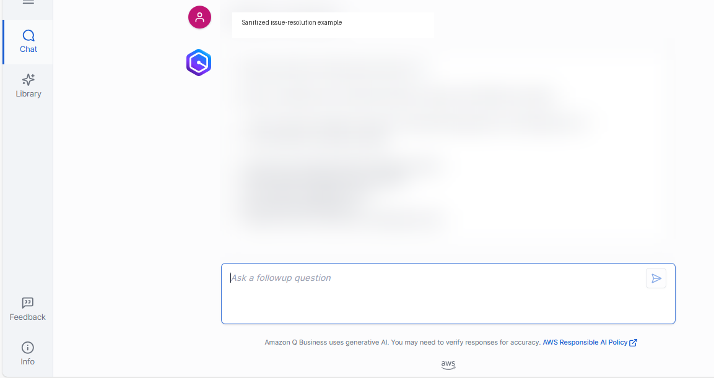
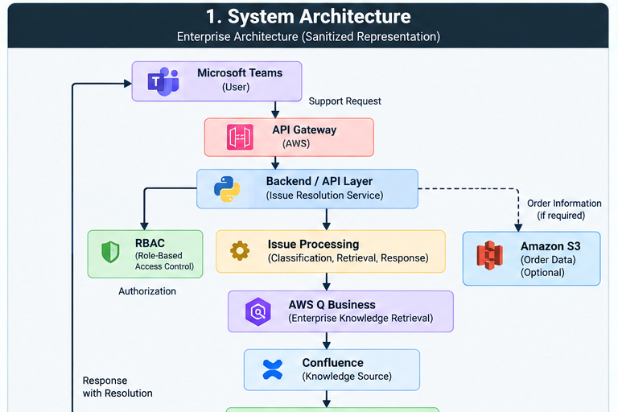

# AI Issue Resolution Platform

### Enterprise AI-powered support automation using RAG, FastAPI & AWS

<p align="center">


</p>

---

> **Portfolio / Internship Showcase**
>
> This repository is a sanitized technical showcase of an
> AI-powered issue-resolution solution I contributed to during
> my software engineering internship at **Titan Company Limited
> (TATA)**.
>
> Production credentials, proprietary knowledge-base content,
> customer/order data, internal URLs, and organization-specific
> infrastructure configuration have been excluded.
>
> The repository contains representative implementation code,
> synthetic data, architecture documentation, workflows, and
> engineering patterns intended to demonstrate the solution and
> my contributions.

---

## Overview

The **AI Issue Resolution Platform** is an enterprise support
automation workflow designed to help users resolve recurring
technical and operational issues through knowledge retrieval
and contextual responses.

The internship solution combined AI-powered enterprise
knowledge retrieval with API-based issue processing,
authorization, fallback handling, and enterprise integrations.

The public repository provides a runnable, sanitized
demonstration of these engineering concepts using synthetic
knowledge data.

---

## Problem

Enterprise support teams frequently receive repetitive issues
that require users or support engineers to manually search
through existing documentation.

This creates challenges such as:

- Repeated manual investigation
- Slow access to relevant knowledge
- Inconsistent responses
- Difficulty handling ambiguous queries
- Unnecessary escalation of known issues

The objective was to create a workflow capable of retrieving
relevant enterprise knowledge and returning contextual support
responses.

---

## Solution

The solution introduced an AI-powered issue-resolution workflow
that:

1. Receives a support request.
2. Validates the incoming request.
3. Performs authorization checks.
4. Processes and classifies the issue.
5. Retrieves relevant knowledge.
6. Builds contextual information for resolution.
7. Returns a structured response.
8. Uses a fallback path when the issue cannot be confidently
   resolved.

The internship architecture used **AWS Q Business** with a
**Confluence-backed knowledge source**.

The public repository uses a synthetic local knowledge base so
that the project can run without enterprise credentials.

---

## Key Features

- AI-powered enterprise knowledge retrieval
- RAG-oriented issue-resolution workflow
- Role-based access control
- REST API using FastAPI
- Request validation
- Fallback handling for unsupported queries
- Application-level observability
- Automated unit and integration testing
- Environment-based configuration
- GitHub Actions CI
- Interactive Swagger / OpenAPI documentation
- Sanitized public architecture with synthetic data

---

## Tech Stack

### Backend & Programming

<p align="left">
  
  
</p>

**Python** · **FastAPI** · **REST APIs** · **Pydantic**

---

### Cloud & AWS

<p align="left">
  
</p>

**AWS Q Business** · **AWS Lambda** · **API Gateway** · **Amazon S3**

---

### AI & Knowledge Retrieval

<p align="left">
  
  
  
</p>

**RAG** · **AWS Q Business** · **LLM-based knowledge retrieval** · **Confluence**

---

### Security & API

<p align="left">
  
  
  
</p>

**RBAC** · **REST APIs** · **OpenAPI / Swagger** · **Pydantic Validation**

---

## Internship Project Screenshots

The following screenshots are sanitized visual references from
the internship project. They demonstrate the enterprise
knowledge-retrieval and issue-resolution workflows without
exposing proprietary data, credentials, or internal systems.

### AI-Powered Issue Resolution

Example of an enterprise knowledge-retrieval interaction using
AWS Q Business.



### Order Information Retrieval

Example of structured information retrieval through the support
workflow.


> **Note:** Screenshots have been sanitized for public portfolio
> use. Customer information, order details, internal URLs,
> identifiers, and other potentially sensitive information have
> been removed or replaced with representative content.

---

### Enterprise Integration

<p align="left">
  
</p>

**Microsoft Teams** · **Bot/API Integration** · **Confluence**

---

### Testing & DevOps

<p align="left">
  
  
  
</p>

**Python unittest** · **GitHub Actions** · **Git** · **GitHub**

> **Note:** AWS Q Business, Confluence, Lambda, API Gateway,
> S3, and Microsoft Teams represent technologies from the
> internship architecture. The public repository uses a local
> synthetic retrieval implementation to avoid exposing
> proprietary systems, data, or credentials.

---

## Architecture

The platform follows a layered architecture that separates
API handling, authorization, issue processing, knowledge
retrieval, and response generation.



### High-Level Flow

```text
Microsoft Teams
       │
       ▼
API / Backend Layer
       │
       ▼
Authentication / RBAC
       │
       ▼
Issue Processing
       │
       ├───────────────┐
       ▼               ▼
AWS Q Business        S3
       │               │
       ▼               ▼
Confluence        Order Data
       │               │
       └───────┬───────┘
               ▼
       Contextual Response
               │
               ▼
        Microsoft Teams